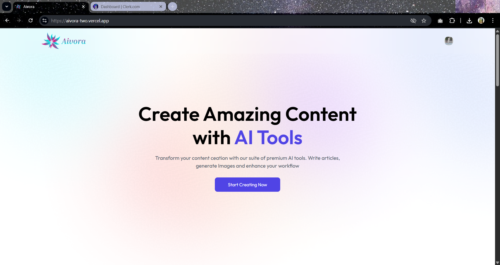
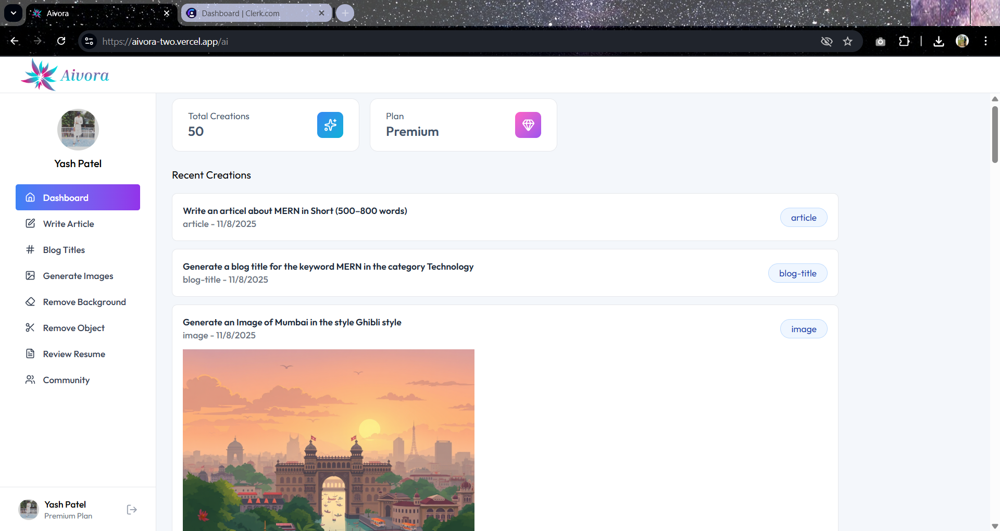
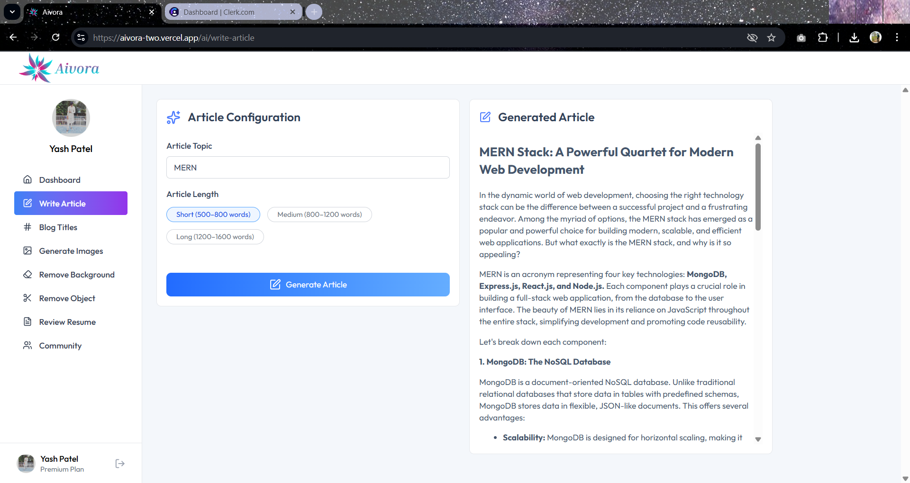
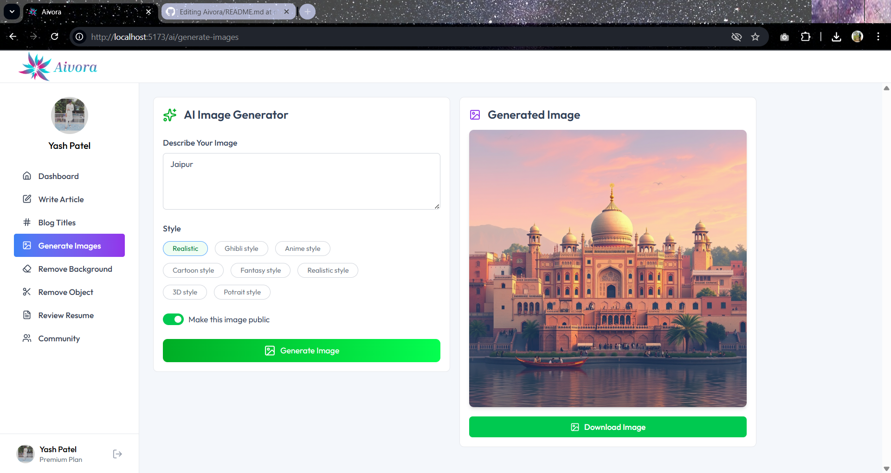
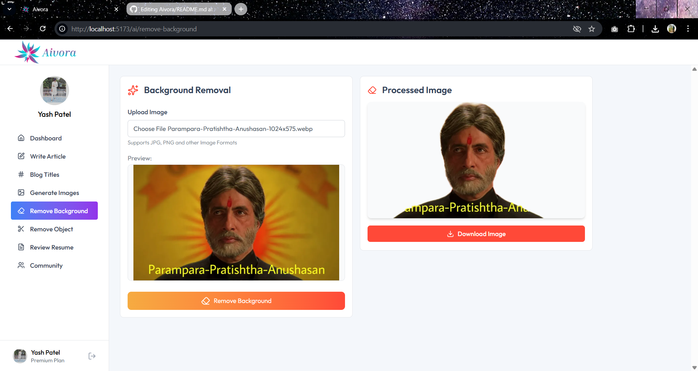
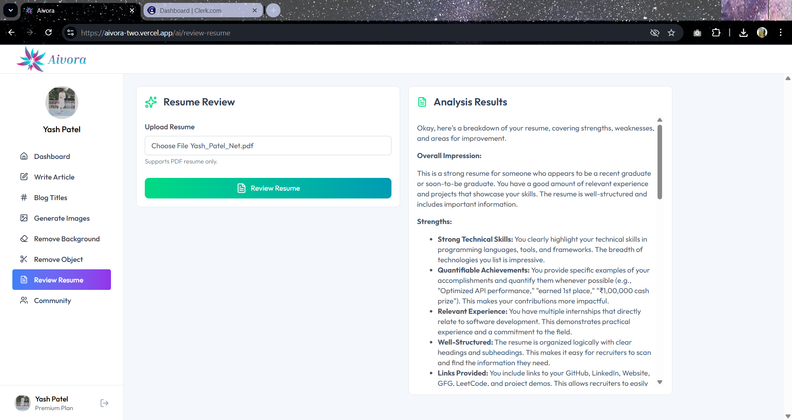
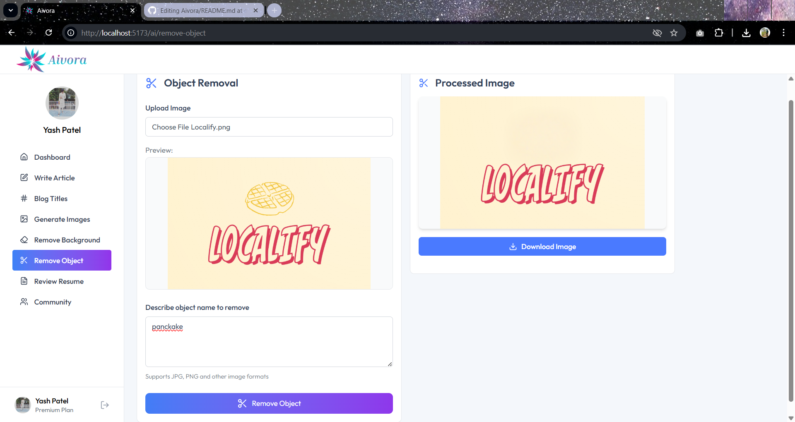
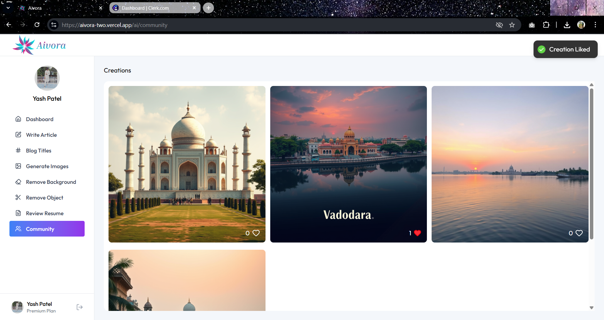
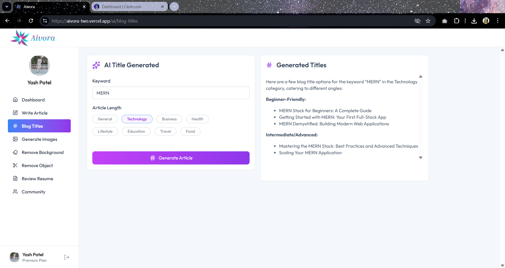

# AI SaaS Platform

  
  

  
  

  
  

  
  

  

---

## 🌟 Project Overview

**AI SaaS Platform** is a full-stack web application providing AI-powered tools for content generation and image processing. Users can:

- Generate articles and blog titles
- Generate AI-based images
- Remove backgrounds or objects from images
- Review resumes with AI feedback
- Interact with a community section to view published content

The platform uses **React.js** for frontend, **Node.js/Express.js** for backend, and **Neon PostgreSQL** as the database. **Clerk** handles authentication, and **Cloudinary** manages image uploads.

The project is deployed on **Vercel (frontend)** and **serverless backend** for fast, scalable operations.

---

## 💻 Technology Stack

**Frontend:**

- React.js with Vite
- Tailwind CSS
- Clerk React for authentication
- Axios for API calls
- React Router DOM
- React Hot Toast for notifications

**Backend:**

- Node.js with Express.js
- Neon Serverless (PostgreSQL)
- Clerk for user authentication
- OpenAI API for AI features
- Cloudinary for image storage
- Multer for file uploads
- pdf-parse for PDF parsing

**Cloud Infrastructure:**
AWS Lambda – Runs the Express backend as a serverless function (no need to manage servers).
AWS API Gateway – Provides the public HTTPS endpoint for all backend API routes.
AWS CloudWatch – Captures logs and monitors Lambda performance for debugging and analytics.
Serverless Framework – Automates deployment of Lambda, API Gateway, and environment variables.
Environment Management – Secrets and configuration handled securely via .env and Serverless plugin.

---

## ⚡ Features

- **User Authentication** – Signup/login with Clerk
- **Dashboard** – View AI tools and user creations
- **AI Article & Blog Generation**
- **Image Generation**
- **Image Editing** – Remove backgrounds/objects
- **Resume Review** – AI-driven feedback
- **Community Section** – View & like creations
- **Admin Features (Optional)** – Monitor users and creations

---

## Test Accounts

- These are demo accounts you can use to:

| No. | Email               | Password (copy-paste) |
| :-: | :------------------ | :-------------------- |
| 1️⃣ | `test1@example.com` | `T3st!_DevAcct_2025`  |
| 2️⃣ | `test2@example.com` | `T3st2!_Sandbox_OK`   |
| 3️⃣ | `test3@example.com` | `Dev-T3st-User#001`   |

- Log in to the platform
- Try out AI tools (article, image, resume review, etc.)
- Test premium features safely without creating new accounts

## Run Project

### 1️⃣ Frontend

1. Navigate to frontend folder:

- cd client
- npm i
- npm run dev

### 2️⃣ Backend

2.Navigate to backend folder:

- cd server
- npm i
- npm run server
